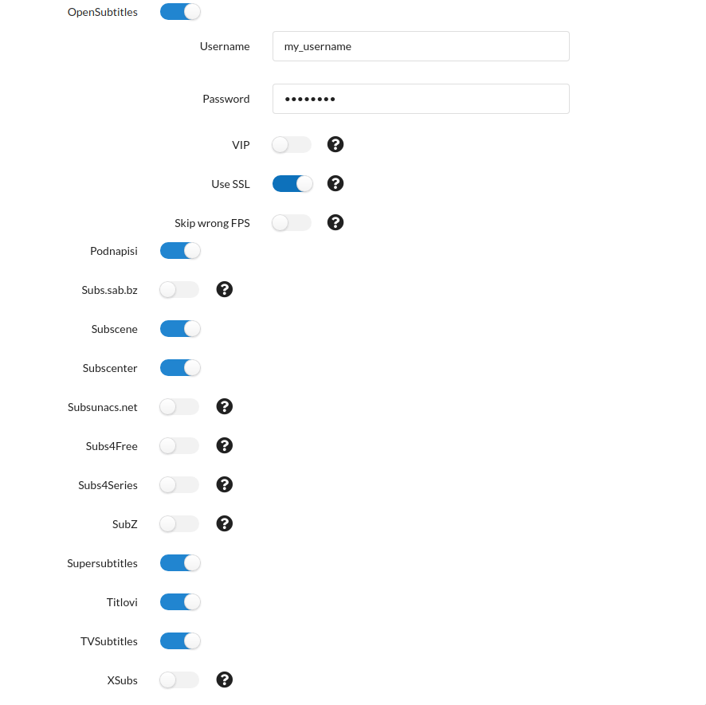
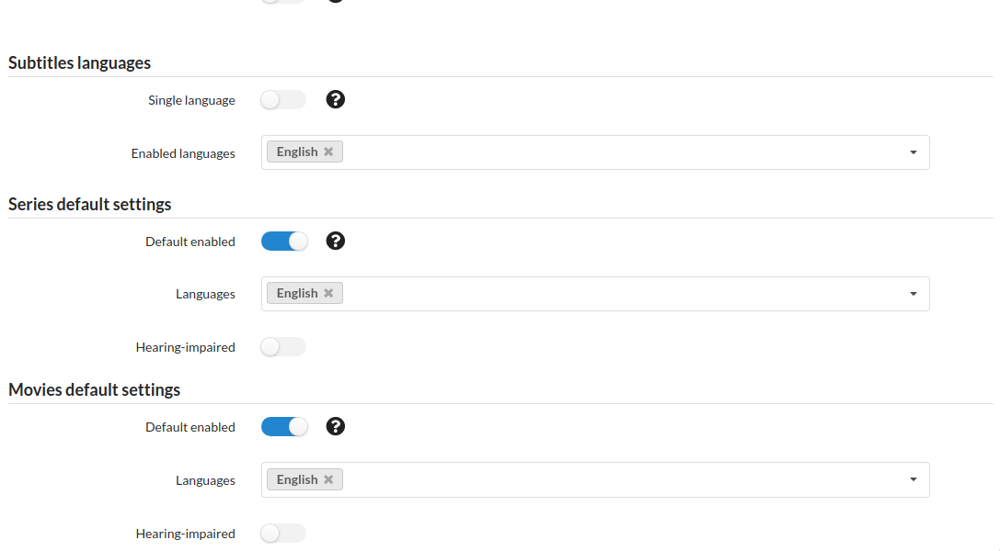
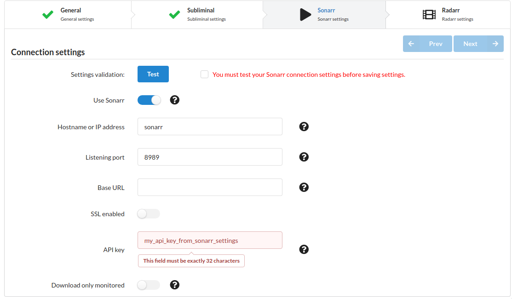
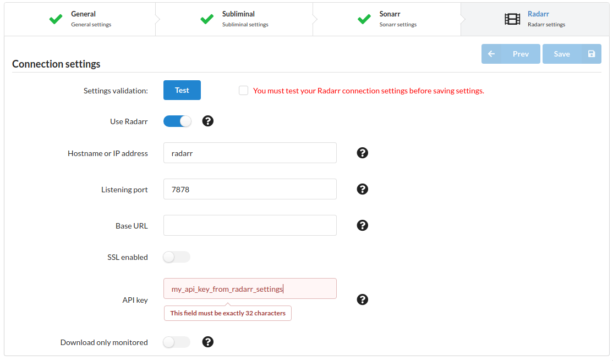
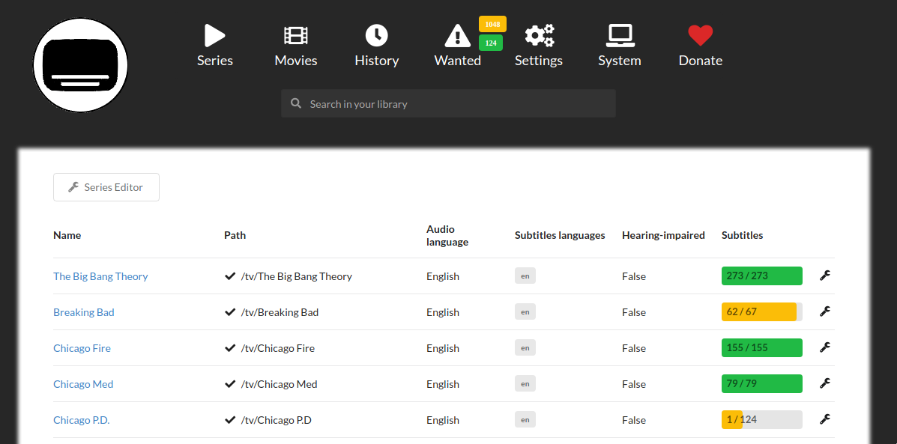

# Setup Bazarr

[Bazarr](https://github.com/morpheus65535/bazarr) is a companion application for Sonarr and Radarr.
It manages and downloads subtitles based on your requirements.
You define your preferences by TV show or movies and Bazarr takes care of everything for you.

## Configuration

Now you should be able to visit `bazarr.localhost`. You'll be greeted with a configuration page.

Click next on the general settings, you can leave those as default. When in the subliminal settings, for English subtitles, I'd recommend setting the subtitles providers like this:

These are the registration-free providers + opensubtitles. Opensubtitles will probably provide a majority of the subtitles, and it is highly recommended you make an account to use it with [here](https://www.opensubtitles.org).

On the bottom of the subliminal settings page, set your settings like this for English (or for your preferred languages):

Next, in your sonarr settings, you'll want to set it up like this:

Replace the api key with your api key found in Sonarr at `Settings/General/Security/API Key`

Radarr settings are basically the same:

Replace the api key with your api key found in Radarr at `Settings/General/Security/API Key`

The interface is based off of Radarr and Sonarr, so it should be familiar. Subtitles should start populating tracked shows that are in Sonarr and Radarr automatically.
