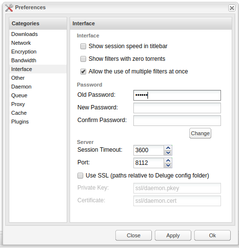

# Setup Deluge

## Configuration

You should now be able to login at `deluge.localhost` with the default password of `deluge`. Once you do that, click "Yes" to change the default password.

Enter "deluge" into the old password field, leave new/confirm password blank, and click change. This will let you login to deluge without a password. Security isn't necessary for this, as we'll handle that externally later on.

Refresh, and if prompted with a Connection Manager window, click the first result and click connect. Then go to preferences.

Here, in `Preferences/Downloads`, you'll want to check "Move completed to", and change the paths to the ones shown above.

You can also tweak queue settings, defaults are fairly small. Also you can decide to stop seeding after a certain ratio is reached. That will be useful for Sonarr, since Sonarr can only remove finished downloads from deluge when the torrent has stopped seeding. Setting a very low ratio is not very fair though !

You can use the Web UI manually to download any torrent from a .torrent file or magnet hash.

## Verify VPN is working

You can check that qbittorrent is properly going out through the VPN IP by using [torguard check](https://torguard.net/checkmytorrentipaddress.php).
Get the torrent magnet link there, put it in Deluge, wait a bit, then you should see your outgoing torrent IP on the website.

If the VPN is properly working, you should see an ip address that is from the VPN, rather than your own.

You should check your current public IP [here](https://www.whatismyip.com/) against the listed one to make sure it works properly. It is important this works.
