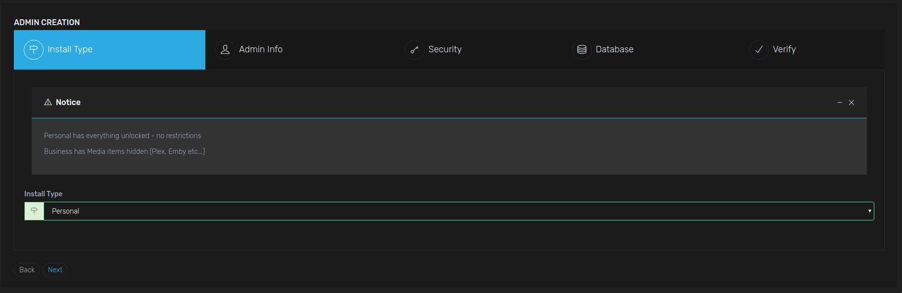
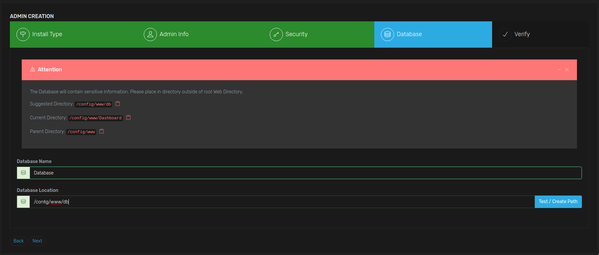
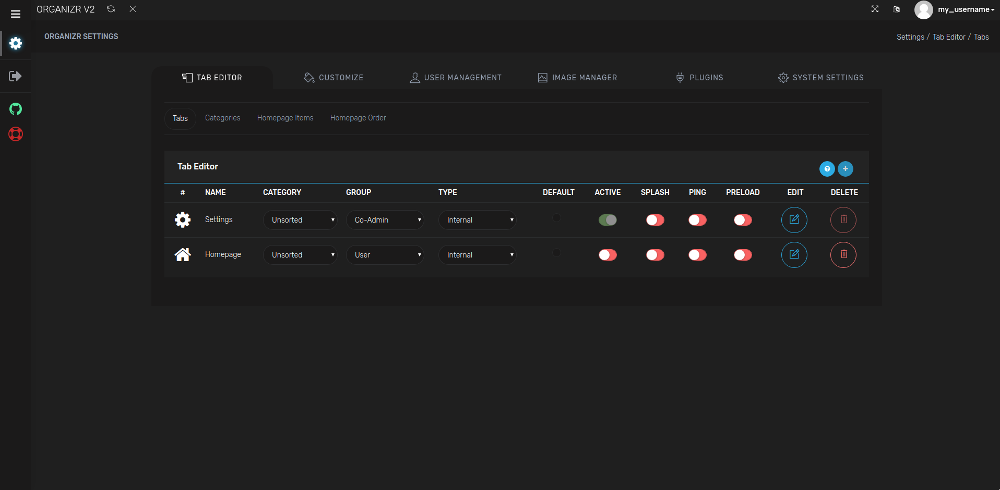
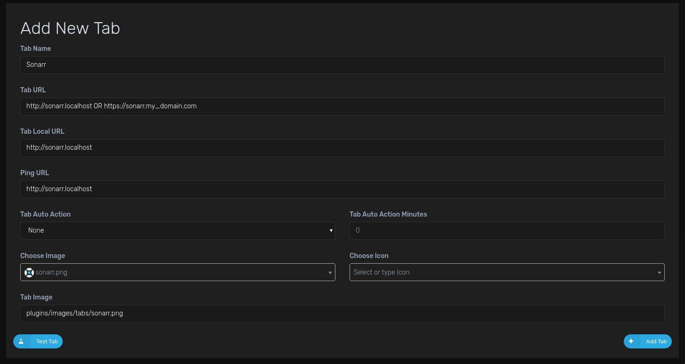
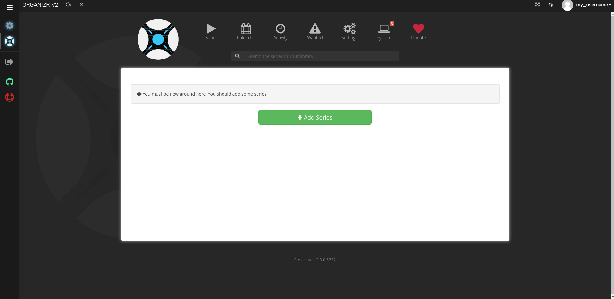

# Setup Organizr

[Organizr](https://github.com/causefx/Organizr) is a web UI to bring together all of your apps in one place. It allows you to setup "tabs" that will be loaded into one webpage. It will allow you to securely login to it and block access to anyone else. You can support multiple users, and guests as well.

## Configuration

Go to `organizr.localhost` to get to the initial setup page.

Choose the `Personal` license on this first page.

In the next two pages, fill out your admin registration, and in security set the passwords it asks for (same as admin user is fine).

In the `Database` tab, just keep it simple and set it up like I did above.

Once you verify your entered information is correct, you should navigate to the `Settings/Tab Editor` page.

Press the plus, and you can create your first Tab:

This is an example tab for Sonarr, and you'll want to create one for each app you want to access.

Things to note here:

- Tab name: Whatever you want it to be, name of the app is fine.
- Tab URL: If you are using the base configuration without https, fill this with the `localhost` version, but if you are using https, you'll want to fill it with your domain. This can always be changed later.
- Tab local URL: Local version of the app, could be the same as the Tab URL. This will be in the form `http://service_name.localhost`
- Ping URL: Same as Tab local URL
- Choose Image: Most of the apps have icons to choose from here, this will be displayed on the side.

Finally, test the tab to make sure it can connect, then click `Add Tab` and refresh.

#### Time to add more apps

From here, you'll want to add all of your apps so you can access them all in one place without a million tabs open - it is much more convenient.

Here is what a final result should look like (this just has Sonarr added):

