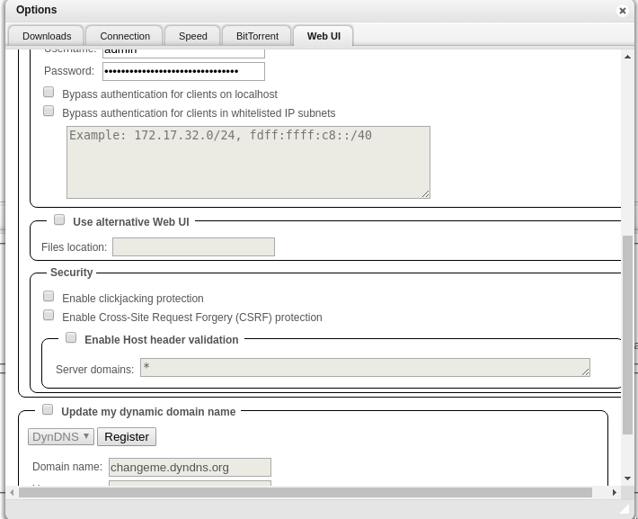
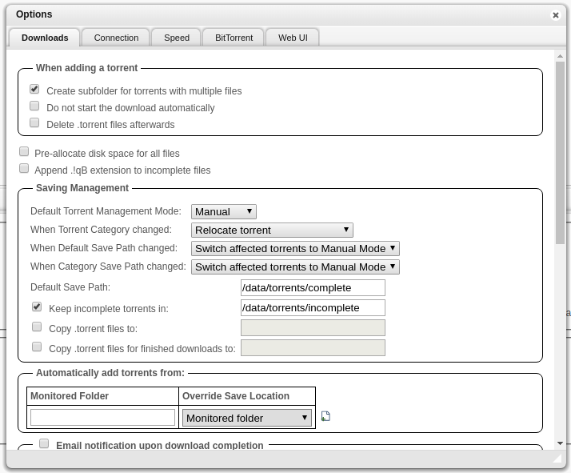

# Setup qBittorrent

## Configuration

You should now be able to login at `localhost:8113` with the default username:password of `admin:adminadmin`

Note that we can't login at `qbit.localhost`, we'll fix this issue in a second.

Here, in `Settings/Web UI/Security`, you'll want to disable all three options (clickjacking, Cross-Site, and Host Header validation).
These are security options that aren't necessary with the reverse proxy that we use, and we need to disable them so the reverse proxy will work.

The reverse proxy with qbittorrent can be a bit buggy sometimes, and I'm looking to improve it. Make sure to refresh and do things like that if it isn't working.

In download settings, you'll want to set the `Default Save Path` and `Keep Incomplete Torrents In` settings to to paths shown in the image above.

You can also tweak queue settings, defaults are fairly small. Also you can decide to stop seeding after a certain ratio is reached. That will be useful for Sonarr, since Sonarr can only remove finished downloads from deluge when the torrent has stopped seeding. Setting a very low ratio is not very fair though !

You can use the Web UI manually to download any torrent from a .torrent file or magnet hash.

## Verify VPN is working

You can check that qbittorrent is properly going out through the VPN IP by using [torguard check](https://torguard.net/checkmytorrentipaddress.php).
Get the torrent magnet link there, put it in Deluge, wait a bit, then you should see your outgoing torrent IP on the website.

If the VPN is properly working, you should see an ip address that is from the VPN, rather than your own.

You should check your current public IP [here](https://www.whatismyip.com/) against the listed one to make sure it works properly. It is important this works.
