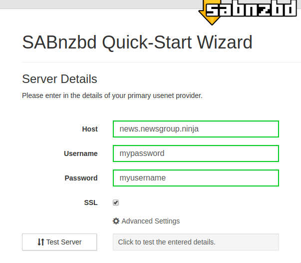
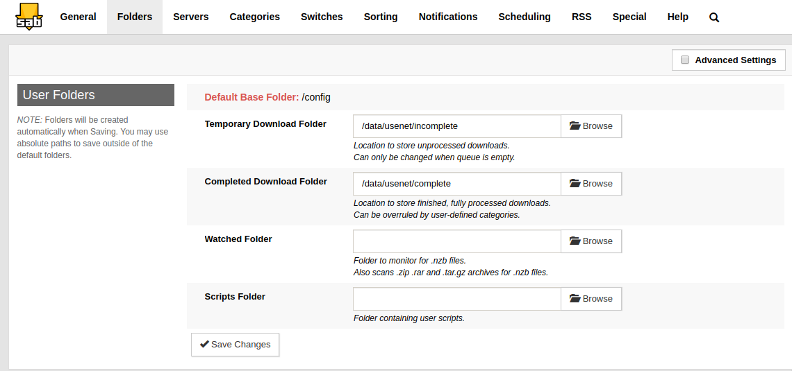
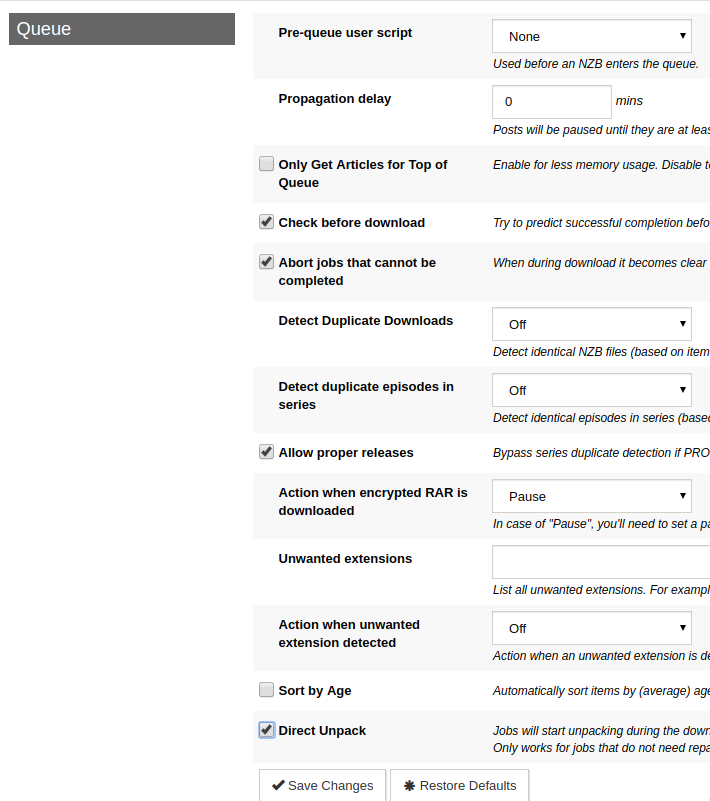
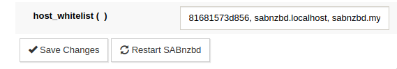

# Setup Sabnzbd

[Sabnzbd](https://sabnzbd.org/) is an open-source usenet downloader. This will be used to download from our usenet backend, and integrate with Sonarr/Radarr.

## Configuration and usage

The Web UI is available at `localhost:8081`. After we configure this, you can access it at `sabnzbd.localhost`.

First, choose your language and click Start Wizard.

In the Server Details page, you'll want to enter your usenet provider information, usually available on your dashboard with them. I use newsgroup ninja, and I recommend it.

You should make sure you enable SSL, and you might need to change the port under "Advanced Settings" to make sure the port matches. You probably also want to raise the number of connections from the default 8, I raised mine to 30, though it will be unique to each provider how many you're allowed.

Test your server to make sure the connection works, then click next, then finish the Quick-Start Wizard. You might need to re-navigate to `localhost:8081`.

Now, click the Gear icon for settings, and go to to `Folders` tab. From here, change the `Temporary Download Folder` and `Completed Download Folder` paths as shown above.

Now, navigate to the switches tab, and enable "advanced settings". Under the Queue section, enable "Check before download" and "Direct unpack", as shown in the image above.

Finally, navigate to the "Special" tab and scroll to the bottom. In the "host whitelist" field, add `sabnzbd.localhost` to the comma-separated list as shown above.

Optionally, if you plan on using https + remote access, add `sabnzbd.my_domain.com`, where my_domain.com is the domain you own and plan to use.

Now, with those settings, you can properly go to `sabnzbd.localhost` to access sabnzbd instead of `localhost:8081`.
